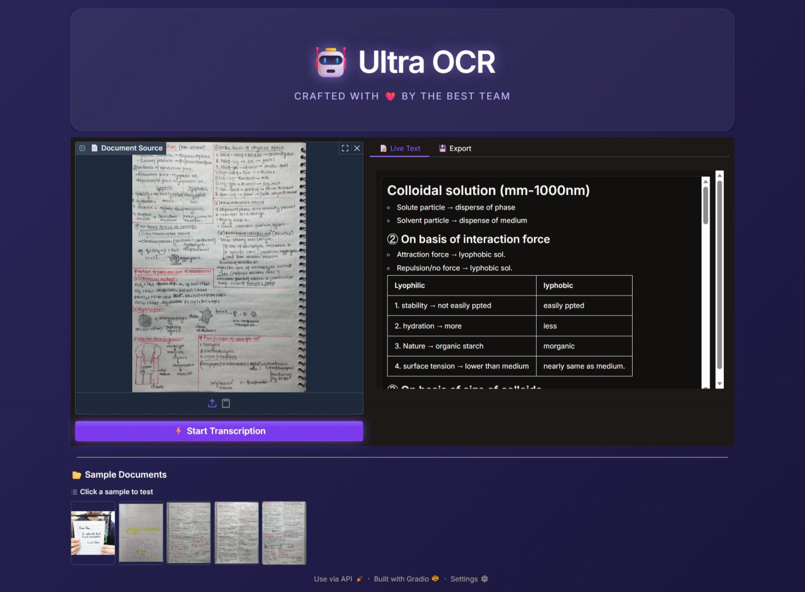

# 🤖 Ultra OCR - Intelligent Document Analysis

<div align="center">
  <h3>Next-Gen OCR empowered by LightOnOCR-2-1B</h3>
  <p>Transcribe documents, handwriting, and tables into formatted Markdown & Word docs.</p>
</div>

## 🎥 Project Demo

<video src="DEMO%20PPIT.mov.mp4" controls="controls" width="100%"></video>

> *If the video doesn't play, [download it here](DEMO%20PPIT.mov.mp4).*

---

## 🚀 Key Features

*   **✨ Advanced Vision-Language Model**: Powered by `lightonai/LightOnOCR-2-1B`, capable of reading dense text, tables, and even handwriting.
*   **📐 LaTeX & Math Support**: Automatically detects and formats chemical and mathematical equations (e.g., $\text{Na}^+ + \text{Cl}^- \to \text{NaCl}$).
*   **📄 Smart Word Export**: Converts the transcribed Markdown directly into a styled `.docx` file for immediate use.
*   **🎨 Glassmorphism UI**: A beautiful, dark-themed interface built with **Gradio**, featuring animated backgrounds and responsive design.
*   **⚡ Real-Time Streaming**: Watch the text appear token-by-token as the model generates it.

## 📸 Screenshots



---

## 🛠️ Installation

1.  **Clone the Repository**
    ```bash
    git clone https://github.com/Ziptoze/PPIT.git
    cd PPIT
    ```

2.  **Install Dependencies**
    ```bash
    pip install -r requirements.txt
    ```
    *Note: You may need `git` installed to fetch the transformers library directly from source.*

3.  **Run the App**
    ```bash
    python app.py
    ```

## 🧠 Model Details

*   **Base Model**: [LightOnOCR-2-1B](https://huggingface.co/lightonai/LightOnOCR-2-1B)
*   **Optimization**: Dynamically switches between `bfloat16` (GPU) and `float32` (CPU).
*   **Format**: Returns structured Markdown with Headers, Lists, and LaTeX.

## 📂 Project Structure

*   `app.py`: The main application logic and UI.
*   `data/`: Contains sample images for testing.
*   `Screenshots/`: Application previews.
*   `requirements.txt`: Python dependencies.

---
*Created for Semester 8 PPIT Phase 1*
